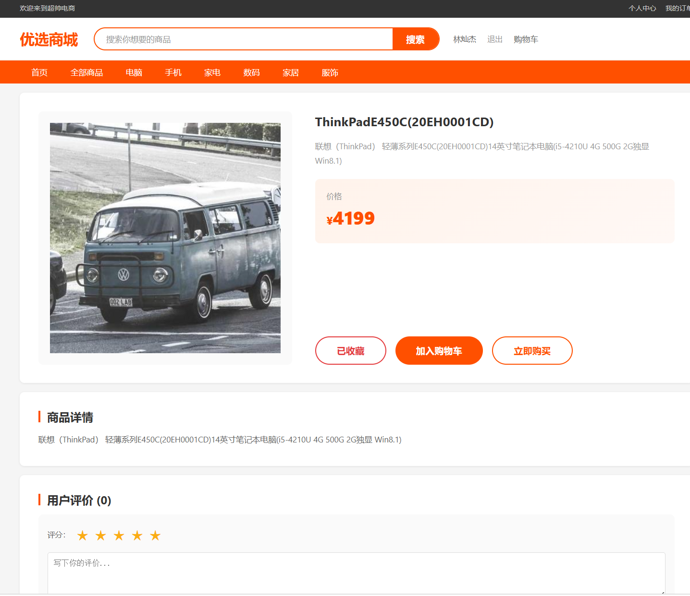
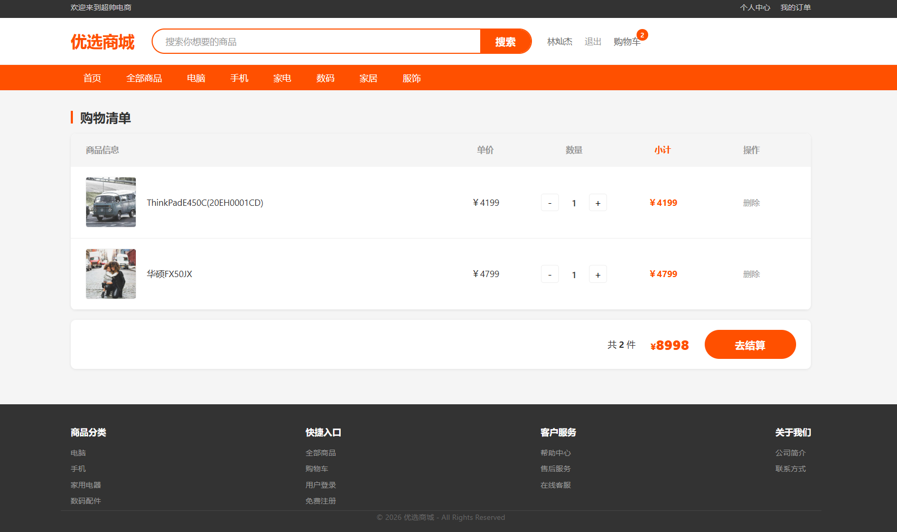
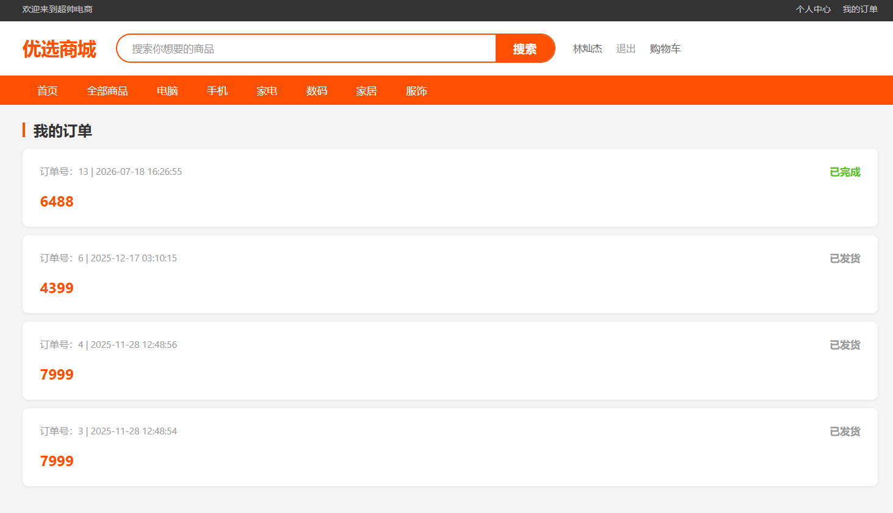
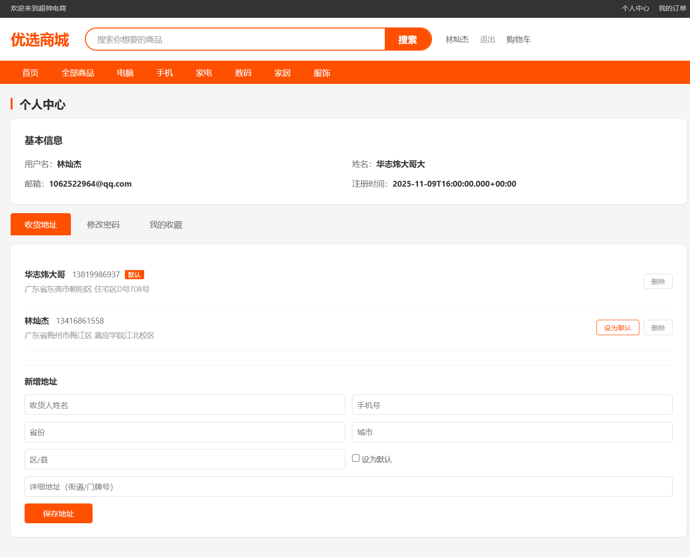
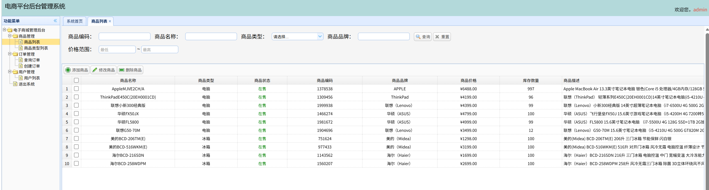

# 🛒 优选商城 (Preferred Mall)

> Spring Boot + Vue 2 全栈电商平台 | 从零搭建的完整在线购物系统

[](https://adoptium.net/)
[](https://spring.io/projects/spring-boot)
[](https://vuejs.org/)
[](https://www.mysql.com/)
[](LICENSE)

---

## 📸 界面预览

| 首页 | 商品详情 |
|------|----------|
|  |  |

| 购物车 | 我的订单 |
|--------|----------|
|  |  |

| 个人中心 | 后台管理 |
|----------|----------|
|  |  |

---

## 🧩 功能清单

### 商城前台
- **商品浏览** — 首页推荐 + 10大分类筛选 + 分页加载 + 模糊搜索
- **用户系统** — 注册 / 登录 / JWT 鉴权 / 管理员也能登录
- **购物车** — 未登录存 localStorage / 已登录同步数据库 / 登录自动合并
- **订单流程** — 确认订单 → 模拟支付 → 确认收货 → 完成（支持取消）
- **商品评价** — 五星打分 + 文字评论 + 支持匿名
- **收藏功能** — 一键收藏 / 取消 + 个人中心收藏列表
- **个人中心** — 收货地址 CRUD + 修改密码 + 我的订单

### 后台管理
- **商品管理** — 商品列表 / 商品类型 / 图片一键上传
- **订单管理** — 查询订单 / 创建订单
- **用户管理** — 用户列表
- **权限控制** — 菜单树 + 角色权限（普通用户看不到后台入口）

### 安全
- JWT Token 鉴权（纯 JDK 实现，零依赖）
- BCrypt 密码加密 + 明文兼容自动升级

---

## 🛠 技术栈

| 层级 | 技术 |
|------|------|
| 前端 | Vue 2 + Vuex + Vue Router + Axios |
| 后端 | Spring Boot 2.7 + MyBatis + Spring MVC |
| 后台管理 | Spring MVC + JSP + EasyUI |
| 数据库 | MySQL 8.0 |
| 安全 | JWT (HMAC-SHA256) + BCrypt |
| 构建 | Maven + Vue CLI |

---

## 📁 项目结构

```
webweb/
├── eshop/                    Spring Boot 商城（内嵌前端）
│   ├── pom.xml
│   └── src/main/java/com/eshop/
│       ├── Application.java          启动类
│       ├── config/                   配置（CORS/静态资源/拦截器）
│       ├── controller/               控制器（10个）
│       │   ├── ProductInfoController 商品
│       │   ├── UserController        用户
│       │   ├── OrderInfoController   订单
│       │   ├── CartController        购物车
│       │   ├── FavoriteController    收藏
│       │   ├── ReviewController      评价
│       │   ├── AddressController     地址
│       │   ├── AdminController       图片管理
│       │   └── SpaController         SPA路由
│       ├── dao/                      MyBatis DAO
│       ├── pojo/                     实体类
│       ├── service/                  业务逻辑
│       └── util/                     JWT / BCrypt
├── shopping/                 Vue 2 前端源码
│   ├── src/views/            页面（home/list/product/cart/login...）
│   ├── src/components/       通用组件
│   ├── src/router/           路由 + 导航守卫
│   └── src/store/            Vuex 状态管理
├── ecpbm/                    后台管理系统
│   └── web/                  JSP 页面 + EasyUI
├── plan.md                   开发计划
└── README.md
```

---

## 🚀 快速启动

### 环境要求

| 工具 | 版本 |
|------|------|
| JDK | 17+ |
| MySQL | 8.0+ |
| Maven | 3.6+ |
| Node.js | 16+（仅前端开发需要） |

### 1. 创建数据库

```sql
CREATE DATABASE IF NOT EXISTS eshop DEFAULT CHARACTER SET utf8mb4;
```

将数据库表结构导入（导出命令：`mysqldump -uroot -p --no-data eshop > sql/init.sql`）

### 2. 配置文件

```bash
cp eshop/src/main/resources/application.properties.template    eshop/src/main/resources/application.properties
```

编辑 `application.properties`，填入你的数据库密码：

```properties
spring.datasource.password=你的密码
```

### 3. 启动服务

```bash
# 编译
cd eshop
mvn clean package -DskipTests

# 启动（内嵌前端 + API + 管理工具）
java -jar target/eshop-1.0.0.jar

# 启动后台管理（可选）
# 配置 Tomcat 9，端口设为 8081，部署 ecpbm 模块
```

### 4. 访问

| 页面 | 地址 |
|------|------|
| 商城首页 | http://localhost:8080/eshop/ |
| 用户登录 | http://localhost:8080/eshop/login |
| 后台管理 | http://localhost:8081/ecpbm/admin_login.jsp |
| 图片管理 | http://localhost:8080/eshop/admin |

### 测试账号

| 角色 | 用户名 | 密码 |
|------|--------|------|
| 普通用户 | john | 123456 |
| 管理员 | admin | 123456 |

---

## 💻 前端开发

```bash
cd shopping
npm install
npm run serve      # 开发服务器（端口 8088，API 代理到 8080）
npm run build      # 生产构建 → eshop/src/main/resources/static/
```

---

## 📋 开发计划

详见 [plan.md](plan.md)

---

## 📄 License

MIT — 仅供学习交流使用
